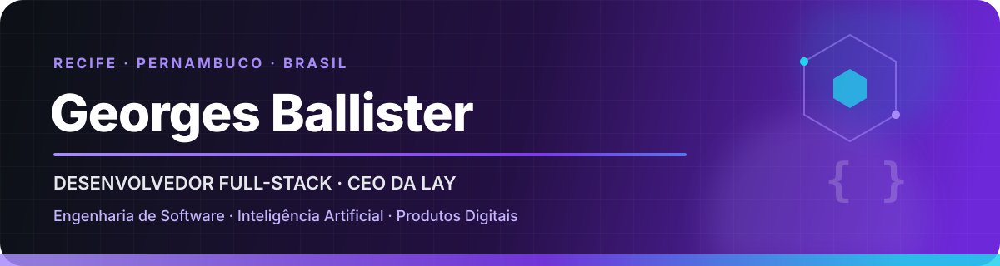

  

  
  
  
  

## Olá, eu sou Georges.

Sou desenvolvedor **Full-Stack**, formado em **Análise e Desenvolvimento de Sistemas** e estudante de **Ciência da Computação**. Construo produtos de ponta a ponta: interfaces, APIs, persistência, integrações, automações e soluções orientadas por dados e inteligência artificial.

Meu trabalho combina visão de produto com engenharia. Gosto de entender o problema, definir contratos claros e entregar software simples de manter — sem abstrações vazias e sem tecnologia escolhida só por moda.

> **Código claro. Arquitetura coerente. Documentação útil. Automação com propósito.**

- 📍 Recife, Pernambuco, Brasil
- 💼 Desenvolvedor Full-Stack e **CEO da LAY**
- 🧠 Foco em engenharia de software, arquitetura, IA, dados e integrações
- ✍️ Produzo conteúdo sobre tecnologia, desenvolvimento e organização do conhecimento
- 🎮 Fora do código: games, anime, design, cultura geek e tecnologia

## LAY

> ### CEO da LAY
>
> A **LAY** é a minha empresa e uma parte central do que estou construindo profissionalmente. A identidade visual, o posicionamento, os projetos e os canais oficiais serão apresentados aqui em breve.

## Stack técnica

  

### Desenvolvimento

- **Back-end:** C#, .NET, Entity Framework Core, Node.js, Express, Python, Flask e APIs REST
- **Front-end:** TypeScript, JavaScript, React, React Native, Vite, Tailwind CSS, HTML e CSS
- **Stack principal:** C#, .NET, TypeScript, JavaScript, Node.js e Python

### Dados, IA e infraestrutura

- **Dados e Machine Learning:** Pandas, NumPy, scikit-learn, TensorFlow, Keras, Jupyter e Streamlit
- **Bancos e armazenamento:** MySQL, SQLite, MongoDB, ClickHouse e MinIO
- **Integrações e infraestrutura:** Docker, Kafka, Git, GitHub, Postman e Insomnia
- **Produto e documentação:** Figma, Notion e Trello

## Projetos em destaque

<table>
  <tr>
    <td width="50%" valign="top">
      <h3><a href="https://github.com/GeorgesBallister/frontCameras-APP">🌬️ Aeolus — Front-end</a></h3>
      
Interface de monitoramento de câmeras e eventos em tempo real, com visualização de anomalias e integração com API, MinIO e ClickHouse.

      
<code>React</code> <code>TypeScript</code> <code>Vite</code> <code>Tailwind CSS</code> <code>Framer Motion</code>

    </td>
    <td width="50%" valign="top">
      <h3><a href="https://github.com/GeorgesBallister/Desafio-Aeolus">⚙️ Desafio Aeolus — Back-end</a></h3>
      
Pipeline distribuído para ingestão e processamento de eventos de câmeras, com API REST, persistência especializada e testes automatizados.

      
<code>Node.js</code> <code>Kafka</code> <code>MinIO</code> <code>ClickHouse</code> <code>MongoDB</code> <code>Docker</code>

    </td>
  </tr>
  <tr>
    <td width="50%" valign="top">
      <h3><a href="https://github.com/GeorgesBallister/Recife-Events-Aggregator">📍 Recife Events Aggregator</a></h3>
      
Agregador de eventos com scraping, API, filtros, deduplicação, auditoria detalhada e persistência local.

      
<code>Node.js</code> <code>Express</code> <code>Puppeteer</code> <code>JavaScript</code>

    </td>
    <td width="50%" valign="top">
      <h3><a href="https://github.com/GeorgesBallister/Diagn-stico-de-C-ncer-de-Mama-com-Redes-Neurais-Multicamadas-MLP-">🧠 Classificação com MLP</a></h3>
      
Estudo de Machine Learning para classificação de tumores, cobrindo preparação dos dados, treino, regularização e avaliação do modelo.

      
<code>Python</code> <code>TensorFlow</code> <code>Keras</code> <code>scikit-learn</code>

    </td>
  </tr>
  <tr>
    <td width="50%" valign="top">
      <h3><a href="https://github.com/GeorgesBallister/API-Flask-PosGraduacao">🐍 API Flask</a></h3>
      
API RESTful integrada a SQLite e a uma interface desktop, desenvolvida no contexto da pós-graduação.

      
<code>Python</code> <code>Flask</code> <code>SQLite</code> <code>Tkinter</code>

    </td>
    <td width="50%" valign="top">
      <h3><a href="https://github.com/GeorgesBallister/Desafio-XMX-Guaraherb">🌿 GaRAHERB</a></h3>
      
Landing page responsiva criada para um desafio front-end, com experiência completa disponível em produção.

      
<code>HTML</code> <code>CSS</code> <code>JavaScript</code> · <a href="https://guaraherb.netlify.app/">Ver projeto</a>

    </td>
  </tr>
</table>

  <a href="https://github.com/GeorgesBallister?tab=repositories"><strong>Explorar todos os meus repositórios →</strong></a>

## Formação e capacitação

- 🎓 **Análise e Desenvolvimento de Sistemas** — Centro Universitário Senac / Porto Digital · concluído
- 💻 **Ciência da Computação** — UNIFG · em andamento
- 📊 **MBA em Data Science e Inteligência Artificial** — Centro Universitário Senac
- 🚀 **Discover: Especializar** — Rocketseat
- 🧩 Capacitações em **Modelagem de Software** e **Programação de Soluções Computacionais** — UNIFG
- 🌎 Português nativo e inglês intermediário

Continuo estudando por meio de projetos, documentação oficial e plataformas como [Rocketseat](https://app.rocketseat.com.br/me/georges-ballister-00588) e [Alura](https://cursos.alura.com.br/user/georgesballister-profissional).

## Conteúdo e ideias

Também escrevo sobre fundamentos da internet, desenvolvimento web, CSS, organização de conhecimento e conceitos de engenharia de software. Os artigos e publicações estão reunidos no meu [LinkedIn](https://www.linkedin.com/in/georges-ballister-de-oliveira/recent-activity/articles/).

## Laboratório pessoal

Uso um ambiente preparado para desenvolvimento, multitarefa, design e experiências com IA local:

`Windows 11 Pro` · `Ryzen 9 9900X` · `RTX 5070 Ti 16 GB` · `32 GB RAM` · `~2,8 TB SSD` · `3440 × 1440 @ 165 Hz`

## GitHub em números

  
  
  
  

  

## Vamos construir algo?

Estou aberto a conversar sobre desenvolvimento de software, produtos digitais, IA, automação, projetos e boas ideias.

  <a href="mailto:georgesballister.profissional@gmail.com"><strong>Enviar e-mail</strong></a>
  &nbsp;•&nbsp;
  <a href="https://www.linkedin.com/in/georges-ballister-de-oliveira/"><strong>Conectar no LinkedIn</strong></a>

